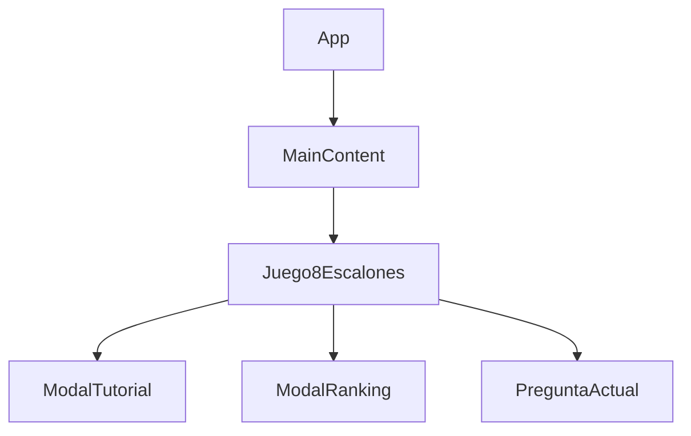

# Documentación Completa del Proyecto "8 Escalones del Conocimiento"

## 📄 README.md

```markdown
# 8 Escalones del Conocimiento - Juego de Trivia Interactivo


Un juego de trivia con 8 niveles de dificultad creciente, donde los jugadores ponen a prueba sus conocimientos contra el tiempo.

## 🚀 Características Principales

- ✅ 8 niveles de dificultad progresiva
- ⏱️ Sistema de tiempo limitado por pregunta
- 🎮 Tres tipos de comodines estratégicos
- 📊 Sistema de puntuación y ranking
- 🏆 Guardado de récords en localStorage
- ⌨️ Atajos de teclado para jugabilidad rápida
- 📱 Diseño 100% responsive (mobile-first)
- 🎨 Estética gamer con animaciones

## 🛠️ Tecnologías Utilizadas

- React 18
- React Router DOM
- SCSS (sin mixins ni variables)
- Mobile-first design
- LocalStorage para persistencia de datos

## 📂 Estructura del Proyecto

```
src/
├── assets/
│   ├── scss/
│   │   ├── _01-Base/         # Estilos base
│   │   ├── _02-Layout/       # Estructuras principales
│   │   └── _03-Componentes/  # Estilos por componente
├── componentes/
│   ├── Juego8Escalones.jsx   # Componente principal del juego
│   └── MainContent.jsx       # Contenedor del juego
├── data/
│   └── preguntas8Escalones.json # Banco de preguntas
└── App.js                    # Punto de entrada principal
```

## 🎮 Cómo Jugar

1. Ingresa tu nombre
2. Responde preguntas antes de que se acabe el tiempo
3. Usa comodines estratégicamente:
   - **50/50**: Elimina 2 respuestas incorrectas
   - **+15s**: Añade tiempo extra
   - **Salvar Escalón**: Continúa después de fallar
4. Avanza por los 8 escalones de dificultad
5. Intenta superar el récord de puntos

## ⌨️ Atajos de Teclado

| Tecla       | Acción                     |
|-------------|----------------------------|
| 1-4         | Seleccionar respuesta      |
| Enter       | Confirmar respuesta        |
| 5           | Usar comodín 50/50         |
| 6           | Usar comodín +15 segundos  |

## 🧩 Componentes Principales

### Juego8Escalones.jsx
El núcleo del juego con toda la lógica:
- Gestión de estados del juego
- Temporizador
- Sistema de puntuación
- Manejo de comodines
- Control de flujo del juego

### MainContent.jsx
Contenedor principal que:
- Proporciona el layout base
- Incluye el componente del juego
- Maneja el diseño responsive

## 🎨 Guía de Estilos

Estrategia mobile-first con:
- Breakpoints en 768px (tablet) y 1024px (desktop)
- Diseño limpio sin variables SCSS
- Efectos visuales gamer:
  - Gradientes oscuros
  - Sombras neón
  - Animaciones de feedback

## 📦 Instalación

1. Clonar repositorio
```bash
git clone [url-del-repositorio]
```

2. Instalar dependencias
```bash
npm install
```

3. Iniciar aplicación
```bash
npm run dev
```

## 📝 Banco de Preguntas

El archivo `preguntas8Escalones.json` contiene:
- Preguntas organizadas por categoría
- 4 opciones por pregunta
- Dificultad del 1 al 8
- Respuesta correcta identificada

Ejemplo de estructura:
```json
{
  "id": 1,
  "pregunta": "¿Cuál es la capital de Francia?",
  "opciones": ["Londres", "Berlín", "París", "Madrid"],
  "respuestaCorrecta": "París",
  "categoria": "Geografía",
  "dificultad": 1
}
```

## 📊 Sistema de Puntuación

- **Base**: 100 puntos por escalón
- **Bonus**: +10% por tiempo restante
- **Multiplicador**: x1 a x8 según escalón
- **Récords**: Guardados en localStorage

## 🌟 Contribuciones

¡Las contribuciones son bienvenidas! Por favor:
1. Haz fork del proyecto
2. Crea tu rama (`git checkout -b feature/nueva-funcionalidad`)
3. Haz commit de tus cambios (`git commit -m 'Añade nueva funcionalidad'`)
4. Haz push a la rama (`git push origin feature/nueva-funcionalidad`)
5. Abre un Pull Request

## 📄 Licencia

MIT License - Ver archivo LICENSE.md para detalles
```

## 📂 Estructura de Documentación Adicional

### 📝 ARCHITECTURE.md
```markdown
# Arquitectura del Sistema

## Diagrama de Componentes



## Flujo de Datos

1. **Inicialización**:
   - Carga preguntas desde JSON
   - Verifica localStorage para récords

2. **Ciclo del Juego**:
   - Muestra pregunta
   - Ejecuta temporizador
   - Evalúa respuesta
   - Actualiza estado/progreso

3. **Persistencia**:
   - Guarda puntuaciones en localStorage
   - Actualiza ranking
```

### 🎮 GAMEDESIGN.md
```markdown
# Documentación de Diseño del Juego

## Mecánicas Principales

1. **Progresión por Escalones**:
   - 8 niveles de dificultad
   - Preguntas más difíciles en escalones altos

2. **Sistema de Comodines**:
   - 50/50: Elimina 2 opciones incorrectas
   - +15s: Añade tiempo al reloj
   - Salvavidas: Permite continuar tras fallar

3. **Temporizador**:
   - 30 segundos por pregunta
   - Feedback visual cuando <10s

## Balance del Juego

- Puntos base: 100 x número de escalón
- Tiempo ajustado a dificultad
- Limitación de comodines por partida
```

### 🛠️ STYLEGUIDE.md
```markdown
# Guía de Estilos Frontend

## Tipografía
- **Principal**: 'Orbitron', sans-serif
- **Tamaños**:
  - Mobile: 1rem base
  - Desktop: 1.2rem base

## Paleta de Colores
- Fondo: #0d0d0d a #1a1a1a (gradiente)
- Aciertos: #00f5ff
- Errores: #ff5555
- Texto: #ffffff con opacidad 0.9

## Breakpoints
- Mobile: <768px (estilos base)
- Tablet: ≥768px
- Desktop: ≥1024px

## Convenciones SCSS
- Organización por componentes
- Sin variables ni mixins
- Selectores anidados máximo 3 niveles
```


